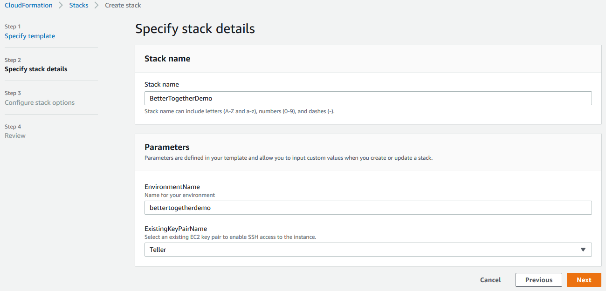
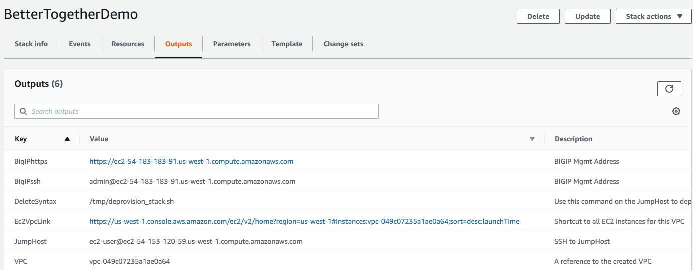
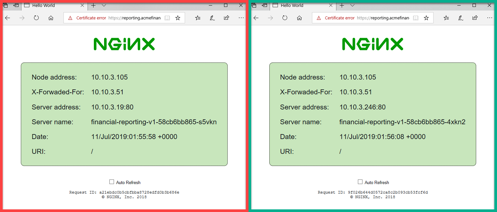
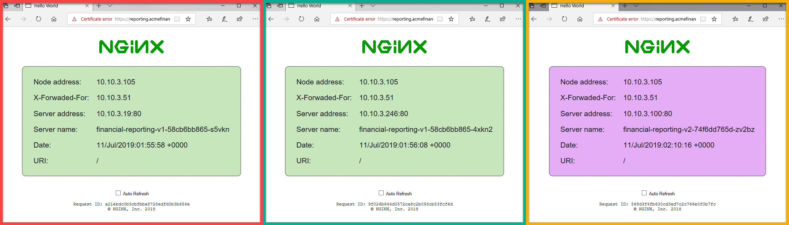

## 1) Deploy the CFT
1. Deploy the CFT and provide an EnvironmentName and Select your SSH-KeyPair
    * The EnvironmentName must be lowercase alpha and is used for naming of all created objects

2. Once your environment is created you can SSH into the JumpHost and Big-IP to start exploring the deployed infrastructure
    * As the JumpHost is provisioned it establishes environment variables, if you SSH in before they are populated you may have to exit your session and restart it


## 2) Verify your Demo Environment
### 2_A) Verify JumpHost
All steps in this session will assume you have successfully SSH to the JumpHost
1. Check /tmp/setup_k8s.log for error messages
2. Verify you have the correct number of K8s nodes were created
    * kubectl get nodes
    ```bash
    ## Example response
    [ec2-user@ip-10-10-1-10 tmp]$ kubectl get nodes
    NAME                                        STATUS   ROLES    AGE   VERSION
    ip-10-10-3-192.us-west-1.compute.internal   Ready    node     11m   v1.12.8
    ip-10-10-3-211.us-west-1.compute.internal   Ready    master   12m   v1.12.8
    ```
3. Verify the correct number of namespaces were created
    * kubectl get namespaces
    ```bash
    ## Example response
    [ec2-user@ip-10-10-1-10 tmp]$ kubectl get namespaces
    NAME            STATUS   AGE
    bigip-ingress   Active   3m36s
    default         Active   14m
    kube-public     Active   14m
    kube-system     Active   14m
    nginx-ingress   Active   13m
    ```
4. Verify correct number of pods exist in the nginx-ingress namespace
    * kubectl get pods -n nginx-ingress
    ```bash
    ## Example response
    [ec2-user@ip-10-10-1-10 tmp]$ kubectl get pods -n nginx-ingress
    NAME                                          READY   STATUS    RESTARTS   AGE
    nginx-ingress-controller-a-7855674844-z6fqj   1/1     Running   0          6m2s
    nginx-ingress-controller-b-jwqkj              1/1     Running   0          5m3s
    ```
5. If any of the pods in the nginx-ingress namespace are in a state OTHER than Running you can check the log for error messages
    * kubectl logs -n nginx-ingress nginx-ingress-controller-b-jwqkj

6. Verify correct number of pods exist in the bigip-ingress namespace
    * kubectl get pods -n bigip-ingress
    ```bash
    ## Example response
    [ec2-user@ip-10-10-1-10 tmp]$ kubectl get pods -n bigip-ingress
    NAME                                         READY   STATUS    RESTARTS   AGE
    k8s-bigip-ctlr-deployment-5647678499-pkzbc   1/1     Running   0          6m32s
    ```
7. If any of the pods in the bigip-ingress namespace are in a state OTHER than Running you can check the log for error messages
    * kubectl logs -n bigip-ingress k8s-bigip-ctlr-deployment-5647678499-pkzbc

### 2_B) Verify Big-IP
* All steps in this session will assume you have successfully SSH to the Big-Ip and exited TMSH by typing bash
* The default admin password for the GUI is the AWS instance-id
1. Check /tmp/firstrun.log for error messages
    ```bash
    ## Example steps
    admin@(ip-10-10-1-50)(cfg-sync Standalone)(Active)(/Common)(tmos)# bash
    [admin@ip-10-10-1-50:Active:Standalone] ~ # cat /tmp/firstrun.log
    Wed Jul 10 12:17:32 PDT 2019
    #....Truncated....
    ```
2. Verify service account was created
    * tmsh list auth user BigIPk8s
    ```bash
    ## Example response
    [admin@ip-10-10-1-50:Active:Standalone] ~ # tmsh list auth user BigIPk8s
    auth user BigIPk8s {
        description BigIPk8s
        encrypted-password $6$9crzcCdG$Ou9vrOG7iOa2p0tqiUWz8knZIIDtFTS1aAw9RsC6SukYPRa.gc4yIXLeQiLefK2jE.JJBuuf4TqPSD7mRL7pE.
        partition Common
        partition-access {
            all-partitions {
                role admin
            }
        }
        shell none
    }
    ```
3. Verify correct number of Self_IP were created
    * tmsh list net self
    ```bash
    ## Example response
    [admin@ip-10-10-1-50:Active:Standalone] ~ # tmsh list net self
    net self 10.10.3.51/24 {
        address 10.10.3.51/24
        allow-service {
            default
        }
        floating enabled
        traffic-group traffic-group-1
        unit 1
        vlan internal
    }
    net self 10.10.3.52/24 {
        address 10.10.3.52/24
        allow-service {
            default
        }
        traffic-group traffic-group-local-only
        vlan internal
    }
    net self 10.10.2.51/24 {
        address 10.10.2.51/24
        floating enabled
        traffic-group traffic-group-1
        unit 1
        vlan external
    }
    net self 10.10.2.52/24 {
        address 10.10.2.52/24
        traffic-group traffic-group-local-only
        vlan external
    }
    ```
4. Verify AS3 iAppLX was installed
    * tmsh list mgmt shared iapp installed-packages
    ```bash
    ## Example response
    [admin@ip-10-10-1-50:Active:Standalone] ~ # tmsh list mgmt shared iapp installed-packages
    mgmt shared iapp installed-packages 5b78671e-01ea-3d87-b255-4f6da6047846 {
        appName "f5-appsvcs"
        arch "noarch"
        generation 2
        id "5b78671e-01ea-3d87-b255-4f6da6047846"
        kind "shared:iapp:installed-packages:installedpackagestate"
        lastUpdateMicros 1562786863055803
        packageName "f5-appsvcs-3.12.0-5.noarch"
        release "5"
        selfLink "https://localhost/mgmt/shared/iapp/installed-packages/5b78671e-01ea-3d87-b255-4f6da6047846"
        status "READY"
        tags {
            "PLUGIN"
        }
        version "3.12.0"
    }
    mgmt shared iapp installed-packages 1241344f-04f9-3594-b6cb-f7989ebff7df {
        appName "f5-service-discovery"
        arch "noarch"
        generation 2
        id "1241344f-04f9-3594-b6cb-f7989ebff7df"
        kind "shared:iapp:installed-packages:installedpackagestate"
        lastUpdateMicros 1562786871619715
        packageName "f5-service-discovery-1.1.0-1.noarch"
        release "1"
        selfLink "https://localhost/mgmt/shared/iapp/installed-packages/1241344f-04f9-3594-b6cb-f7989ebff7df"
        status "READY"
        tags {
            "PLUGIN"
        }
        version "1.1.0"
    }
    ```
5. Verify nginx partition was created
    * tmsh list auth partition nginx    
    ```bash
    ## Example response
    [admin@ip-10-10-1-50:Active:Standalone] ~ # tmsh list auth partition nginx
    auth partition nginx { }
    ```
6. Verify example virtual-server was created
    * tmsh list ltm virtual k8s_vip_https
    ```bash
    ## Example response
    [admin@ip-10-10-1-50:Active:Standalone] ~ # tmsh list ltm virtual k8s_vip_https
    ltm virtual k8s_vip_https {
        creation-time 2019-07-10:12:20:23
        destination 10.10.2.60:https
        ip-protocol tcp
        last-modified-time 2019-07-10:12:20:23
        mask 255.255.255.255
        profiles {
            clientssl {
                context clientside
            }
            http { }
            tcp { }
        }
        source 0.0.0.0/0
        source-address-translation {
            type automap
        }
        translate-address enabled
        translate-port enabled
        vlans {
            external
        }
        vs-index 2
    }
    ```
7. View public_ip mapped to Big-IP private_ip
    ```bash
    externalMac=`cat /sys/class/net/external/address`
    for pubV4 in `curl -s http://169.254.169.254/latest/meta-data/network/interfaces/macs/${externalMac}/ipv4-associations/`
        do
            privV4=`curl -s http://169.254.169.254/latest/meta-data/network/interfaces/macs/${externalMac}/ipv4-associations/${pubV4}`
            case ${privV4} in
                '10.10.2.60')
                    echo "10.10.2.60 == ${pubV4}"
                    ;;
                '10.10.2.70')
                    echo "10.10.2.70 == ${pubV4}"
                    ;;
            esac
        done

    10.10.2.60 == 54.241.193.4
    10.10.2.70 == 54.183.71.63
    ```
## 3) Create Pool only Big-IP, K8s & F5 Container Ingress Services integration
1. (From JumpHost) Create K8s ingress
    * kubectl apply -f /tmp/bigip-nginx-k8s/0_demo/1_1_create_bigip-ingress_Ingress.yaml
2. (From JumpHost) Verify K8s ingress is working as expected
    * kubectl get ingress -n nginx-ingress
    * kubectl get endpoints -n nginx-ingress
    ```bash
    ## Example response

    [ec2-user@ip-10-10-1-10 0_demo]$ kubectl get ingress -n nginx-ingress
    NAME                         HOSTS   ADDRESS   PORTS   AGE
    bigip-ingress-controller-a   *                 80      116s
    [ec2-user@ip-10-10-1-10 0_demo]$ kubectl get endpoints -n nginx-ingress
    NAME                         ENDPOINTS                        AGE
    nginx-ingress-controller-a   10.10.3.105:80,10.10.3.105:443   74m
    [ec2-user@ip-10-10-1-10 0_demo]$ kubectl get pods -n nginx-ingress -o wide
    NAME                                          READY   STATUS    RESTARTS   AGE   IP            NODE                                        NOMINATED NODE
    nginx-ingress-controller-a-7855674844-z6fqj   1/1     Running   0          77m   10.10.3.105   ip-10-10-3-192.us-west-1.compute.internal   <none>
    nginx-ingress-controller-b-jwqkj              1/1     Running   0          76m   10.10.3.46    ip-10-10-3-192.us-west-1.compute.internal   <none>    
    ```
3. (From Big-IP) verify nginx-ingress pool was created
    * tmsh list ltm pool /nginx/ingress_nginx-ingress_nginx-ingress-controller-a
    ```bash
    ## Example response
    [admin@ip-10-10-1-50:Active:Standalone] ~ # tmsh list ltm pool /nginx/ingress_nginx-ingress_nginx-ingress-controller-a
    ltm pool /nginx/ingress_nginx-ingress_nginx-ingress-controller-a {
        members {
            /nginx/10.10.3.105%0:http {
                address 10.10.3.105
                session monitor-enabled
                state up
            }
        }
        metadata {
            user_agent {
                value k8s-bigip-ctlr-1.9.1-n1591-541111110
            }
        }
        monitor /nginx/ingress_nginx-ingress_nginx-ingress-controller-a_0_http
        partition nginx
    }
    ```
4. Curl to the Public_IP associated to 10.10.2.60, if you need to find the public IP see step 2B_7. Since we have not deployed our demo application you should receive a HTTP Error
    ```bash
    ## Example response
    [admin@ip-10-10-1-50:Active:Standalone] ~ # curl https://54.241.193.4 -k
    <html>
    <head><title>404 Not Found</title></head>
    <body>
    <center><h1>404 Not Found</h1></center>
    <hr><center>nginx/1.17.1</center>
    </body>
    </html>    
    ```
5. Deploy demo-app-v1 to K8s
    1. kubectl apply -f /tmp/bigip-nginx-k8s/0_demo/2_1_deploy_demo-app-v1_Deployment.yaml
    2. kubectl apply -f /tmp/bigip-nginx-k8s/0_demo/2_2_deploy_demo-app-v1_Service.yaml
    ```bash
    ## Example response

    ### Deploy demo-app-v1
    [ec2-user@ip-10-10-1-10 0_demo]$ kubectl apply -f /tmp/bigip-nginx-k8s/0_demo/2_1_deploy_demo-app-v1_Deployment.yaml
    deployment.apps/financial-reporting-v1 created

    ### View pods deployed from 2_1_deploy_demo-app-v1_Deployment.yaml
    [ec2-user@ip-10-10-1-10 0_demo]$ kubectl get pods -o wide
    NAME                                      READY   STATUS    RESTARTS   AGE     IP            NODE                                        NOMINATED NODE
    financial-reporting-v1-58cb6bb865-4xkn2   1/1     Running   0          2m33s   10.10.3.246   ip-10-10-3-192.us-west-1.compute.internal   <none>
    financial-reporting-v1-58cb6bb865-s5vkn   1/1     Running   0          2m33s   10.10.3.19    ip-10-10-3-192.us-west-1.compute.internal   <none>

    ### View pod response
    curl http://10.10.3.246

    ### Deploy demo-app-v1 service
    [ec2-user@ip-10-10-1-10 0_demo]$ kubectl apply -f /tmp/bigip-nginx-k8s/0_demo/2_2_deploy_demo-app-v1_Service.yaml
    service/financial-reporting-v1-svc created

    ### View demo-app-v1 service
    [ec2-user@ip-10-10-1-10 0_demo]$ kubectl get svc financial-reporting-v1-svc -o wide
    NAME                         TYPE        CLUSTER-IP     EXTERNAL-IP   PORT(S)   AGE     SELECTOR
    financial-reporting-v1-svc   ClusterIP   10.10.31.151   <none>        80/TCP    7m37s   app=financial-reporting-v1

    #### Note: Since the Cluster-IP for the service is outside of one of the allocated subnets (10.10.1.0/24, 10.10.2.0/24 & 10.10.3.0/24) it is not reachable from the JumpHost or Big-IP

    ### View endpoints for demo-app-v1 service, notice it maps to the pod addresses
    [ec2-user@ip-10-10-1-10 0_demo]$ kubectl get endpoints financial-reporting-v1-svc  -o wide
    NAME                         ENDPOINTS                      AGE
    financial-reporting-v1-svc   10.10.3.19:80,10.10.3.246:80   10m    
    ```
6. View nginx-ingress virtualServer yaml
    * cat /tmp/bigip-nginx-k8s/0_demo/2_3_create_nginx-ingress_VirtualServer.yaml
    * Notice: The value for the 'host' field, the virtualServer only forwards traffic for defined Fully Qualified Domain Names
    ```bash
    [ec2-user@ip-10-10-1-10 0_demo]$ cat /tmp/bigip-nginx-k8s/0_demo/2_3_create_nginx-ingress_VirtualServer.yaml
    apiVersion: k8s.nginx.org/v1alpha1
    kind: VirtualServer
    metadata:
      name: financial-reporting
    spec:
      host: reporting.acmefinancial.net
      upstreams:
      - name: financial-reporting-v1
        service: financial-reporting-v1-svc
        port: 80
      routes:
      - path: /
        upstream: financial-reporting-v1
    ```
7. Deploy nginx-ingress virtualServer to route traffic to demo-app-v1
    * kubectl apply -f /tmp/bigip-nginx-k8s/0_demo/2_3_create_nginx-ingress_VirtualServer.yaml
    ```bash
    ## Example response

    [ec2-user@ip-10-10-1-10 0_demo]$ kubectl apply -f /tmp/bigip-nginx-k8s/0_demo/2_3_create_nginx-ingress_VirtualServer.yaml
    virtualserver.k8s.nginx.org/financial-reporting created
    ```
8. Curl public_ip used in step4 and include Host Header,
    * curl https://54.241.193.4 -k -H "Host: reporting.acmefinancial.net"
    * Notice: If you attempt to browse to https://54.241.193.4 you will get an HTTP error message unless you update your host file to include a mapping for example (reporting.acmefinancial.net 54.241.193.4)
    ```bash
    ## Example response

    [admin@ip-10-10-1-50:Active:Standalone] ~ # curl https://54.241.193.4 -k -H "Host: reporting.acmefinancial.net"
    <!DOCTYPE html>
    <html>
    <head>
    <title>Hello World</title>
    </head>
    <body>
    .....Truncated....
    </body>
    </html>
    ```
    * Example with host headers, notice the different Server Addresses and Names
    
## 4) Version our demo-app
1. Deploy V2 version up the demo-app
    * kubectl apply -f /tmp/bigip-nginx-k8s/0_demo/3_1_deploy_demo-app-v2_Deployment.yaml
    ```bash
    ## Example response

    [ec2-user@ip-10-10-1-10 ~]$ kubectl apply -f /tmp/bigip-nginx-k8s/0_demo/3_1_deploy_demo-app-v2_Deployment.yaml
    deployment.apps/financial-reporting-v2 created

    ## Notice we now have v1 and v2 pods deployed in our environment
    [ec2-user@ip-10-10-1-10 ~]$ kubectl get pods -o wide
    NAME                                      READY   STATUS    RESTARTS   AGE   IP            NODE                                        NOMINATED NODE
    financial-reporting-v1-58cb6bb865-4xkn2   1/1     Running   0          40m   10.10.3.246   ip-10-10-3-192.us-west-1.compute.internal   <none>
    financial-reporting-v1-58cb6bb865-s5vkn   1/1     Running   0          40m   10.10.3.19    ip-10-10-3-192.us-west-1.compute.internal   <none>
    financial-reporting-v2-74f6dd765d-x8tv7   1/1     Running   0          44s   10.10.3.38    ip-10-10-3-192.us-west-1.compute.internal   <none>
    financial-reporting-v2-74f6dd765d-zv2bz   1/1     Running   0          44s   10.10.3.100   ip-10-10-3-192.us-west-1.compute.internal   <none>
    ```
2. Deploy the V2 Service
    * kubectl apply -f /tmp/bigip-nginx-k8s/0_demo/3_2_create_demo-app-v2_Service.yaml
    ```bash
    ## Example response

    [ec2-user@ip-10-10-1-10 ~]$ kubectl apply -f /tmp/bigip-nginx-k8s/0_demo/3_1_deploy_demo-app-v2_Deployment.yaml
    deployment.apps/financial-reporting-v2 created

    [ec2-user@ip-10-10-1-10 ~]$ kubectl get svc financial-reporting-v2-svc
    NAME                         TYPE        CLUSTER-IP    EXTERNAL-IP   PORT(S)   AGE
    financial-reporting-v2-svc   ClusterIP   10.10.21.93   <none>        80/TCP    19s

    [ec2-user@ip-10-10-1-10 ~]$ kubectl get endpoints financial-reporting-v2-svc
    NAME                         ENDPOINTS                      AGE
    financial-reporting-v2-svc   10.10.3.100:80,10.10.3.38:80   95s
    ```
3. Update nginx-ingress virtualServer to split traffic between the v1 and v2 version of our demo-app
    * kubectl apply -f /tmp/bigip-nginx-k8s/0_demo/3_3_update_nginx-ingress_VirtualServer.yaml
    * Notice: The weight for v1 is 80% and 20% for v2
    ```bash
    [ec2-user@ip-10-10-1-10 ~]$ kubectl apply -f /tmp/bigip-nginx-k8s/0_demo/3_3_update_nginx-ingress_VirtualServer.yaml
    virtualserver.k8s.nginx.org/financial-reporting configured

    [ec2-user@ip-10-10-1-10 ~]$ cat /tmp/bigip-nginx-k8s/0_demo/3_3_update_nginx-ingress_VirtualServer.yaml
    apiVersion: k8s.nginx.org/v1alpha1
    kind: VirtualServer
    metadata:
      name: financial-reporting
    spec:
      host: reporting.acmefinancial.net
      upstreams:
      - name: financial-reporting-v1
        service: financial-reporting-v1-svc
        port: 80
      - name: financial-reporting-v2
        service: financial-reporting-v2-svc
        port: 80
      routes:
      - path: /
        splits:
        - weight: 80
          upstream: financial-reporting-v1
        - weight: 20
          upstream: financial-reporting-v2
    ```
    
## 5) Productionize and Scale our demo-app-v2
1. Scale the V2 deployment
    * kubectl apply -f /tmp/bigip-nginx-k8s/0_demo/4_1_scale_demo_app-v2_Deployment.yaml
    ```bash
    ## Example response

    [ec2-user@ip-10-10-1-10 ~]$ kubectl apply -f /tmp/bigip-nginx-k8s/0_demo/4_1_scale_demo_app-v2_Deployment.yaml

    ## Notice we now have 6 instance of our v2 app
    [ec2-user@ip-10-10-1-10 ~]$ kubectl get pods -o wide
    NAME                                      READY   STATUS    RESTARTS   AGE   IP            NODE                                        NOMINATED NODE
    financial-reporting-v1-58cb6bb865-4xkn2   1/1     Running   0          52m   10.10.3.246   ip-10-10-3-192.us-west-1.compute.internal   <none>
    financial-reporting-v1-58cb6bb865-s5vkn   1/1     Running   0          52m   10.10.3.19    ip-10-10-3-192.us-west-1.compute.internal   <none>
    financial-reporting-v2-74f6dd765d-2sq6t   1/1     Running   0          75s   10.10.3.203   ip-10-10-3-192.us-west-1.compute.internal   <none>
    financial-reporting-v2-74f6dd765d-5dmvr   1/1     Running   0          75s   10.10.3.100   ip-10-10-3-192.us-west-1.compute.internal   <none>
    financial-reporting-v2-74f6dd765d-k4zvx   1/1     Running   0          75s   10.10.3.40    ip-10-10-3-192.us-west-1.compute.internal   <none>
    financial-reporting-v2-74f6dd765d-ppsz2   1/1     Running   0          75s   10.10.3.178   ip-10-10-3-192.us-west-1.compute.internal   <none>
    financial-reporting-v2-74f6dd765d-st5c8   1/1     Running   0          75s   10.10.3.198   ip-10-10-3-192.us-west-1.compute.internal   <none>
    financial-reporting-v2-74f6dd765d-xhnjw   1/1     Running   0          75s   10.10.3.38    ip-10-10-3-192.us-west-1.compute.internal   <none>
    ```
2. Productionize our v2 app by removing v1 from our nginx-ingress virtualServer
    * kubectl apply -f /tmp/bigip-nginx-k8s/0_demo/4_2_remove-v1_nginx-ingress_VirtualServer.yaml
    ```bash
    ## Example response
    [ec2-user@ip-10-10-1-10 ~]$ kubectl apply -f /tmp/bigip-nginx-k8s/0_demo/4_2_remove-v1_nginx-ingress_VirtualServer.yaml
    virtualserver.k8s.nginx.org/financial-reporting configured

    ## Notice the v1 service was removed and we no longer have a weight applied
    [ec2-user@ip-10-10-1-10 ~]$ cat /tmp/bigip-nginx-k8s/0_demo/4_2_remove-v1_nginx-ingress_VirtualServer.yaml
    apiVersion: k8s.nginx.org/v1alpha1
    kind: VirtualServer
    metadata:
      name: financial-reporting
    spec:
      host: reporting.acmefinancial.net
      upstreams:
      - name: financial-reporting-v2
        service: financial-reporting-v2-svc
        port: 80
      routes:
      - path: /
        upstream: financial-reporting-v2
    ```

## 5) Create Big-IP, K8s & F5 Container Ingress Services integration using AS3
1. Deploy service AS3 will use to map to the nginx-ingress-controller pods
    * kubectl apply -f /tmp/bigip-nginx-k8s/0_demo/5_1_create_bigip-ingress_as3_Basic_Service.yaml
    ```bash
    ## Example response
    [ec2-user@ip-10-10-1-10 ~]$ kubectl apply -f /tmp/bigip-nginx-k8s/0_demo/5_1_create_bigip-ingress_as3_Basic_Service.yaml
    service/f5-as3-basic-service created

    [ec2-user@ip-10-10-1-10 ~]$ kubectl get svc -n nginx-ingress f5-as3-basic-service
    NAME                   TYPE       CLUSTER-IP    EXTERNAL-IP   PORT(S)        AGE
    f5-as3-basic-service   NodePort   10.10.6.126   <none>        80:32147/TCP   16s
    ```
2. Apply the AS3 configmap, this will create the required virtual and pool on the Big-IP
3. (From Big-IP) View created virtual and pool
    * tmsh list ltm virtual /as3_tenant/as3_basic_app/basic_app
    * tmsh list ltm pool /as3_tenant/as3_basic_app/as3_basic_pool
    ```bash
    ## Example response

    [admin@ip-10-10-1-50:Active:Standalone] ~ # tmsh list ltm virtual /as3_tenant/as3_basic_app/basic_app
    ltm virtual /as3_tenant/as3_basic_app/basic_app {
        description "ingress: as3-basic-demo"
        destination /as3_tenant/10.10.2.70:http
        ip-protocol tcp
        last-modified-time 2019-07-10:19:48:32
        mask 255.255.255.255
        partition as3_tenant
        persist {
            cookie {
                default yes
            }
        }
        pool /as3_tenant/as3_basic_app/as3_basic_pool
        profiles {
            f5-tcp-progressive { }
            http { }
        }
        rules {
            /as3_tenant/as3_basic_app/x_header_insert
        }
        source 0.0.0.0/0
        source-address-translation {
            type automap
        }
        translate-address enabled
        translate-port enabled
        vs-index 4
    }

    [admin@ip-10-10-1-50:Active:Standalone] ~ # tmsh list ltm pool /as3_tenant/as3_basic_app/as3_basic_pool
    ltm pool /as3_tenant/as3_basic_app/as3_basic_pool {
        members {
            /as3_tenant/10.10.3.46:http {
                address 10.10.3.46
                session monitor-enabled
                state up
                metadata {
                    source {
                        value declaration
                    }
                }
            }
        }
        min-active-members 1
        monitor min 1 of { /as3_tenant/as3_basic_app/http_nginxIngress_monitor }
        partition as3_tenant
    }    
    ```
4. (From JumpHost) Notice that the pool member maps to the pod ip
    * kubectl get pods -n nginx-ingress -l app=nginx-ingress-controller-b -o wide
    ```bash
    ## Example response
    [ec2-user@ip-10-10-1-10 0_demo]$ kubectl get pods -n nginx-ingress -l app=nginx-ingress-controller-b -o wide
    NAME                               READY   STATUS    RESTARTS   AGE     IP           NODE                                        NOMINATED NODE
    nginx-ingress-controller-b-jwqkj   1/1     Running   0          7h55m   10.10.3.46   ip-10-10-3-192.us-west-1.compute.internal   <none>
    ```    
5. Curl to the Public_IP associated to 10.10.2.70, if you need to find the public IP see step 2B_7.
    * Notice: If you attempt to browse to http://54.183.71.63 you will get an HTTP error message unless you update your host file to include a mapping for example (reporting.acmefinancial.net 54.183.71.63)
    ```bash
    ## Example response
    [admin@ip-10-10-1-50:Active:Standalone] ~ # curl http://54.183.71.63 -k -H "Host: reporting.acmefinancial.net"
    <!DOCTYPE html>
    <html>
    <head>
    <title>Hello World</title>
    </head>
    <body>
    .....Truncated....
    </body>
    </html>  
    ```

## 6) Scale nginx-ingress-controllers
1. (From JumpHost) Using /tmp/bigip-nginx-k8s/0_demo/6_1_scale_k8s_nodes.sh modify KOPs worker node from 1 to 3
    * cat /tmp/bigip-nginx-k8s/0_demo/6_1_scale_k8s_nodes.sh
    * sudo chwon ec2-user:ec2-user /tmp/bigip-nginx-k8s/0_demo/6_1_scale_k8s_nodes.sh
    * chmod +x /tmp/bigip-nginx-k8s/0_demo/6_1_scale_k8s_nodes.sh
    * /tmp/bigip-nginx-k8s/0_demo/6_1_scale_k8s_nodes.sh
    ```bash
    ## Example response

    [ec2-user@ip-10-10-1-10 0_demo]$ cat /tmp/bigip-nginx-k8s/0_demo/6_1_scale_k8s_nodes.sh
    #!/bin/bash

    kops get ig nodes -o json | jq '.spec.minSize=3|.spec.maxSize=3' | kops replace -f /dev/stdin
    kops update cluster --yes

    [ec2-user@ip-10-10-1-10 0_demo]$ sudo chown ec2-user:ec2-user /tmp/bigip-nginx-k8s/0_demo/6_1_scale_k8s_nodes.sh  

    [ec2-user@ip-10-10-1-10 0_demo]$ chmod +x /tmp/bigip-nginx-k8s/0_demo/6_1_scale_k8s_nodes.sh

    [ec2-user@ip-10-10-1-10 0_demo]$ /tmp/bigip-nginx-k8s/0_demo/6_1_scale_k8s_nodes.sh
    Using cluster from kubectl context: bettertogetherdemo.k8s.local

    Using cluster from kubectl context: bettertogetherdemo.k8s.local

    I0711 03:01:50.749673    4245 apply_cluster.go:559] Gossip DNS: skipping DNS validation
    I0711 03:01:51.032133    4245 executor.go:103] Tasks: 0 done / 92 total; 46 can run
    I0711 03:01:51.450644    4245 executor.go:103] Tasks: 46 done / 92 total; 23 can run
    I0711 03:01:51.694397    4245 executor.go:103] Tasks: 69 done / 92 total; 19 can run
    I0711 03:01:52.201516    4245 executor.go:103] Tasks: 88 done / 92 total; 3 can run
    I0711 03:01:53.073550    4245 executor.go:103] Tasks: 91 done / 92 total; 1 can run
    I0711 03:01:53.272888    4245 executor.go:103] Tasks: 92 done / 92 total; 0 can run
    I0711 03:01:53.331660    4245 update_cluster.go:291] Exporting kubecfg for cluster
    kops has set your kubectl context to bettertogetherdemo.k8s.local

    Cluster changes have been applied to the cloud.


    Changes may require instances to restart: kops rolling-update cluster    
    ```
2. (From JumpHost) Verify additional nodes have been created
    * kubectl get nodes
    ```bash
    ## Example response

    [ec2-user@ip-10-10-1-10 0_demo]$ kubectl get nodes -o wide
    NAME                                        STATUS   ROLES    AGE    VERSION   INTERNAL-IP   EXTERNAL-IP   OS-IMAGE                       KERNEL-VERSION   CONTAINER-RUNTIME
    ip-10-10-3-18.us-west-1.compute.internal    Ready    node     101s   v1.12.8   10.10.3.18    <none>        Debian GNU/Linux 9 (stretch)   4.9.0-9-amd64    docker://18.6.3
    ip-10-10-3-192.us-west-1.compute.internal   Ready    node     8h     v1.12.8   10.10.3.192   <none>        Debian GNU/Linux 9 (stretch)   4.9.0-9-amd64    docker://18.6.3
    ip-10-10-3-211.us-west-1.compute.internal   Ready    master   8h     v1.12.8   10.10.3.211   <none>        Debian GNU/Linux 9 (stretch)   4.9.0-9-amd64    docker://18.6.3
    ip-10-10-3-235.us-west-1.compute.internal   Ready    node     105s   v1.12.8   10.10.3.235   <none>        Debian GNU/Linux 9 (stretch)   4.9.0-9-amd64    docker://18.6.3
    ```

3. (From JumpHost) Notice that additional pods have been created as well since it was deployed as a DaemonSet
    * kubectl get pods -n nginx-ingress -l app=nginx-ingress-controller-b -o wide
    ```bash
    ## Example response

    [ec2-user@ip-10-10-1-10 0_demo]$ kubectl get pods -n nginx-ingress -l app=nginx-ingress-controller-b -o wide
    NAME                               READY   STATUS    RESTARTS   AGE     IP            NODE                                        NOMINATED NODE
    nginx-ingress-controller-b-29gnc   1/1     Running   0          2m15s   10.10.3.159   ip-10-10-3-18.us-west-1.compute.internal    <none>
    nginx-ingress-controller-b-htxlg   1/1     Running   0          2m19s   10.10.3.190   ip-10-10-3-235.us-west-1.compute.internal   <none>
    nginx-ingress-controller-b-jwqkj   1/1     Running   0          8h      10.10.3.46    ip-10-10-3-192.us-west-1.compute.internal   <none>
    ```

4. (From Big-IP) Notice that the new pods were added as pool members
    * tmsh list ltm pool /as3_tenant/as3_basic_app/as3_basic_pool
    ```bash
    ## Example response

    [admin@ip-10-10-1-50:Active:Standalone] ~ # tmsh list ltm pool /as3_tenant/as3_basic_app/as3_basic_pool
    ltm pool /as3_tenant/as3_basic_app/as3_basic_pool {
        members {
            /as3_tenant/10.10.3.159:http {
                address 10.10.3.159
                session monitor-enabled
                state up
                metadata {
                    source {
                        value declaration
                    }
                }
            }
            /as3_tenant/10.10.3.190:http {
                address 10.10.3.190
                session monitor-enabled
                state up
                metadata {
                    source {
                        value declaration
                    }
                }
            }
            /as3_tenant/10.10.3.46:http {
                address 10.10.3.46
                session monitor-enabled
                state up
                metadata {
                    source {
                        value declaration
                    }
                }
            }
        }
        min-active-members 1
        monitor min 1 of { /as3_tenant/as3_basic_app/http_nginxIngress_monitor }
        partition as3_tenant
    }
    ```
